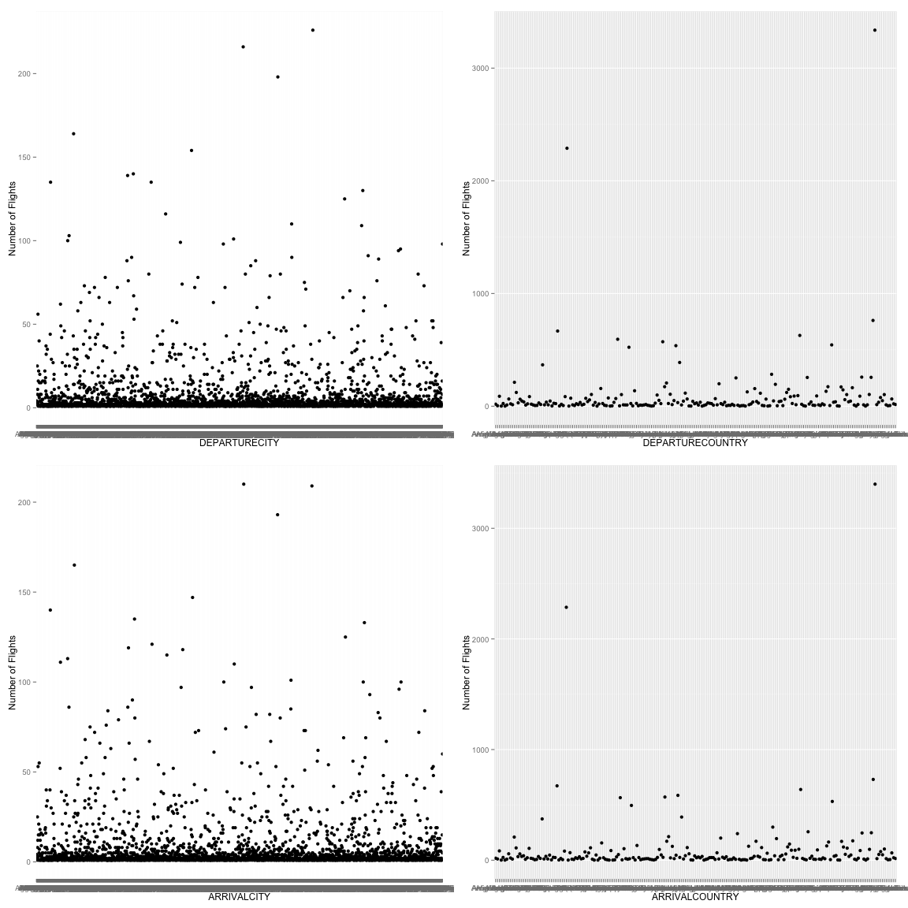
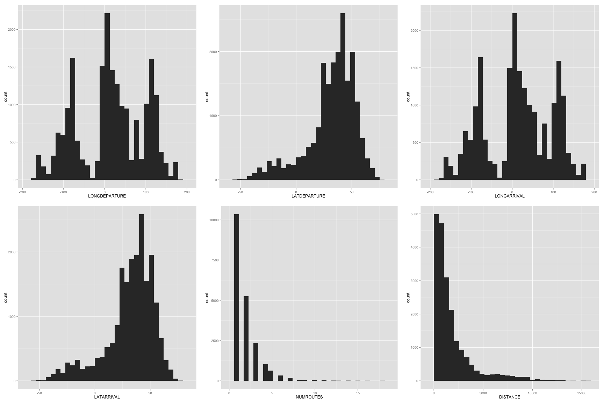

 ---
title: "Airline Flight Data"
author: "Cassie, Caleb & Michael"
date: "Saturday, February 28, 2015"
output: html_document
---


```{r}
source("../01 Data/Dataframes.R", echo = TRUE)
```


```{r}
source("../02 Data Wrangling/Wranglers1.R", echo = TRUE)
```


```{r}
source("../03 Visualizations/Visualizations1.R", echo = TRUE)
```


```{r}
source("../02 Data Wrangling/Wranglers2.R", echo = TRUE)
```


```{r}
source("../03 Visualizations/Visualizations2.R", echo = TRUE)
```


```{r}
source("../02 Data Wrangling/Wranglers3.R", echo = TRUE)
```


```{r}
source("../03 Visualizations/Visualizations3.R", echo = TRUE)
```


```{r}
source("../03 Visualizations/Visualizations4.R", echo = TRUE)
```






